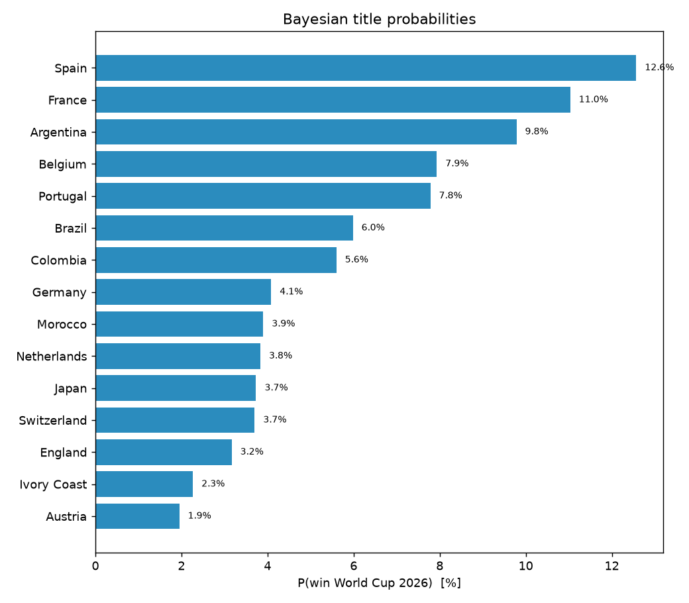
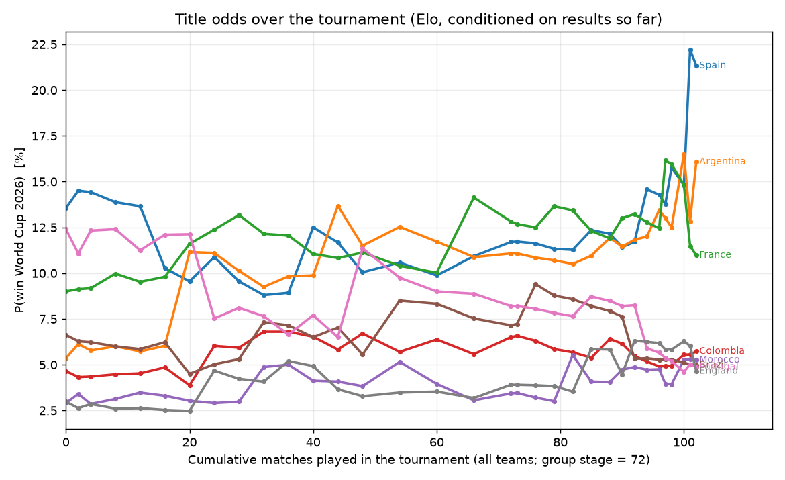

# 🏆 World Cup 2026 — Champion Tracker

_A living, state-aware forecast. Conditioned on the **102 matches played so far**: completed group games are held fixed; the rest of the tournament is simulated from a Bayesian goals model (squad-skill prior + current form + X/ESPN sentiment). Updated 2026-07-16._

## How to read this

1. **Next games** — predicted goals for the upcoming fixtures.
2. **The trophy** — each team's title probability, given everything that has already happened.

Both come from one model: goals are the primitive; the winner is a simulation over goals. See [METHODOLOGY.md](METHODOLOGY.md).

## Title odds — conditioned on current results

| Team | Quarter | Semi | Final | **Champion** |
|---|---|---|---|---|
| Spain | 50% | 28% | 18% | **13%** |
| France | 49% | 27% | 16% | **11%** |
| Argentina | 47% | 25% | 14% | **10%** |
| Belgium | 45% | 23% | 12% | **8%** |
| Portugal | 44% | 23% | 12% | **8%** |
| Brazil | 41% | 22% | 10% | **6%** |
| Colombia | 41% | 21% | 10% | **6%** |
| Germany | 38% | 20% | 9% | **4%** |
| Morocco | 34% | 18% | 9% | **4%** |
| Netherlands | 34% | 17% | 9% | **4%** |
| Japan | 35% | 18% | 8% | **4%** |
| Switzerland | 35% | 18% | 9% | **4%** |

_Mexico's Round-of-32 opponent odds (per candidate): [R32_ODDS.md](R32_ODDS.md) — `make r32-odds`._

## Title odds over time — the movie, not the snapshot

_How each contender's championship probability moved as matches were played. The x-axis is the **cumulative number of matches played across all teams** (the group stage has 72 in total; each team plays 3), not games-per-team and not an abstract t. Built with a fast Elo simulation re-run after every matchday, conditioned only on results known by then — no look-ahead. `make timeline`._

## Next games — predicted goals

| Date | Fixture | Pred goals (xG) | Likely | P(H/D/A) | Home form |
|---|---|---|---|---|---|
| 2026-07-18 | France v England | 1.8-1.0 | 1-0 | 56%/23%/21% | red-hot |
| 2026-07-19 | Spain v Argentina | 1.6-1.5 | 1-1 | 42%/23%/35% | red-hot |

## Current group standings (played)

| Team | P | Pts | GD |
|---|---|---|---|
| Argentina | 7 | 21 | +12 |
| Spain | 7 | 19 | +12 |
| France | 7 | 18 | +12 |
| England | 7 | 16 | +6 |
| Mexico | 5 | 12 | +7 |
| Norway | 6 | 12 | +2 |
| Belgium | 6 | 11 | +7 |
| Switzerland | 6 | 11 | +4 |
| Morocco | 6 | 11 | +4 |
| Colombia | 5 | 11 | +4 |
| Brazil | 5 | 10 | +6 |
| United States | 5 | 9 | +3 |
| Netherlands | 4 | 8 | +6 |
| Portugal | 5 | 8 | +5 |
| Germany | 4 | 7 | +6 |
| Canada | 5 | 7 | +3 |
| Ivory Coast | 4 | 6 | +1 |
| Egypt | 5 | 6 | +1 |
| Croatia | 4 | 6 | -1 |
| Japan | 4 | 5 | +3 |
| Australia | 4 | 5 | +0 |
| Paraguay | 5 | 5 | -3 |
| Congo DR | 4 | 4 | +0 |
| Ghana | 4 | 4 | -1 |
| South Africa | 4 | 4 | -2 |
| Ecuador | 4 | 4 | -2 |
| Bosnia-Herzegovina | 4 | 4 | -3 |
| Sweden | 4 | 4 | -3 |
| Austria | 4 | 4 | -3 |
| Algeria | 4 | 4 | -4 |
| Senegal | 4 | 3 | +1 |
| Iran | 3 | 3 | +0 |
| South Korea | 3 | 3 | -1 |
| Cape Verde | 4 | 3 | -1 |
| Türkiye | 3 | 3 | -2 |
| Scotland | 3 | 3 | -3 |
| Uruguay | 3 | 2 | -1 |
| Saudi Arabia | 3 | 2 | -4 |
| Czechia | 3 | 1 | -4 |
| New Zealand | 3 | 1 | -6 |
| Qatar | 3 | 1 | -8 |
| Curaçao | 3 | 1 | -8 |
| Panama | 3 | 0 | -4 |
| Jordan | 3 | 0 | -5 |
| Haiti | 3 | 0 | -6 |
| Uzbekistan | 3 | 0 | -9 |
| Tunisia | 3 | 0 | -10 |
| Iraq | 3 | 0 | -11 |

## What feeds the prediction

- **Player skillsets** — squad ratings (pace/shooting/passing/…) and seniority form the model's prior, so squad quality shapes goals.
- **Current results** — the posterior is fit on matches through today and the simulation holds played games fixed.
- **Form + X/ESPN sentiment** — folded in as a small, capped goal-rate nudge (see `models/momentum.py`, `data/scouting.py`).
- **Charts:** `artifacts/champion_tracker.png` (title odds), `artifacts/forecast_probs.png`, `artifacts/calibration.png`.