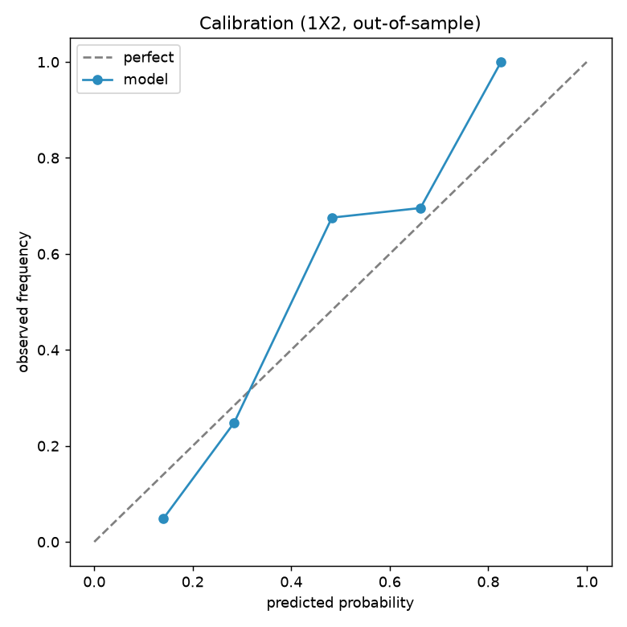
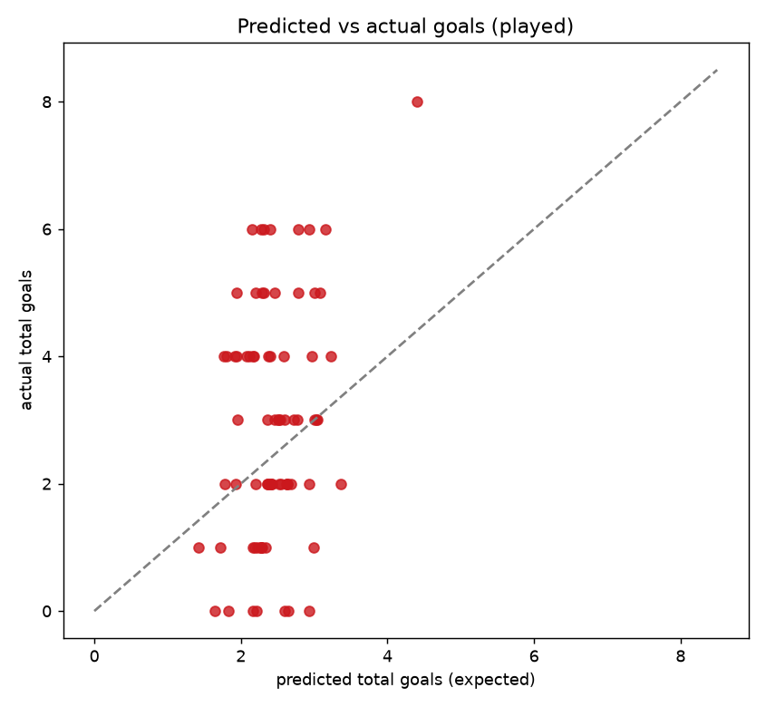
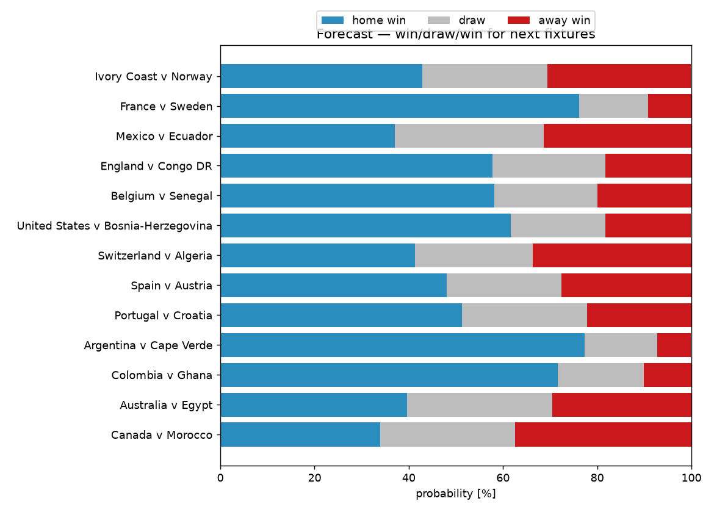

# WC 2026 — Tracking Analytics, Sentiment & Tactics

_Run after each matchday to track model calibration and read the next slate. Charts in `artifacts/`. Compiled 2026-06-30._

## Tracking charts

- **Calibration** (`artifacts/calibration.png`) — are our probabilities honest? Points on the diagonal = well-calibrated.
- **Predicted vs actual goals** (`artifacts/goals_pred_vs_actual.png`) — scatter of expected vs real total goals per played match.
- **Forecast win/draw/win** (`artifacts/forecast_probs.png`) — stacked 1X2 bars for upcoming fixtures.

**Tracking metrics (76 matches):** outcome hit-rate 62% · total-goals MAE 1.48. Re-run to update as results come in.

## Match sentiment & momentum (next fixtures)

| Fixture | Home form | Away form | Momentum edge |
|---|---|---|---|
| Ivory Coast v Norway | rising (+0.09) | steady (+0.04) | **Ivory Coast** |
| France v Sweden | red-hot (+0.16) | dipping (-0.06) | **France** |
| Mexico v Ecuador | rising (+0.12) | steady (+0.03) | **Mexico** |
| England v Congo DR | rising (+0.08) | steady (+0.02) | **England** |
| Belgium v Senegal | red-hot (+0.18) | steady (+0.01) | **Belgium** |
| United States v Bosnia-Herzegovina | steady (+0.03) | steady (-0.02) | **United States** |
| Switzerland v Algeria | rising (+0.12) | steady (+0.01) | **Switzerland** |
| Spain v Austria | rising (+0.11) | rising (+0.07) | **Spain** |
| Portugal v Croatia | red-hot (+0.14) | steady (-0.03) | **Portugal** |
| Argentina v Cape Verde | red-hot (+0.18) | steady (+0.01) | **Argentina** |
| Colombia v Ghana | rising (+0.08) | dipping (-0.09) | **Colombia** |
| Australia v Egypt | steady (+0.03) | steady (+0.04) | **even** |
| Canada v Morocco | rising (+0.11) | rising (+0.08) | **even** |

## Tactical read (next fixtures)

**Ivory Coast v Norway** — best shapes 3-5-2 vs 3-5-2.
  - Defence: home edge (78 vs 75) · Midfield: home edge (80 vs 78) · Attack: even (80 vs 80)
  - home controls midfield; home built around its midfield, away around its attack.

**France v Sweden** — best shapes 3-4-3 vs 3-4-3.
  - Defence: home edge (84 vs 76) · Midfield: home edge (87 vs 77) · Attack: home edge (88 vs 82)
  - home controls midfield; home built around its attack, away around its attack.

**Mexico v Ecuador** — best shapes 3-4-3 vs 3-4-3.
  - Defence: home edge (77 vs 74) · Midfield: home edge (80 vs 75) · Attack: home edge (82 vs 76)
  - home controls midfield; home built around its attack, away around its midfield.

**England v Congo DR** — best shapes 4-3-3 vs 4-4-2.
  - Defence: home edge (85 vs 76) · Midfield: home edge (85 vs 75) · Attack: home edge (88 vs 75)
  - home controls midfield; home built around its attack, away around its defence.

**Belgium v Senegal** — best shapes 3-4-3 vs 4-3-3.
  - Defence: home edge (81 vs 80) · Midfield: home edge (86 vs 78) · Attack: home edge (86 vs 81)
  - home controls midfield; home built around its midfield, away around its attack.

**United States v Bosnia-Herzegovina** — best shapes 4-4-2 vs 4-3-3.
  - Defence: home edge (76 vs 74) · Midfield: away edge (76 vs 78) · Attack: even (76 vs 77)
  - midfield finely balanced; home built around its midfield, away around its midfield.

**Switzerland v Algeria** — best shapes 3-5-2 vs 4-4-2.
  - Defence: even (78 vs 78) · Midfield: home edge (79 vs 78) · Attack: away edge (78 vs 81)
  - midfield finely balanced; home built around its midfield, away around its attack.

**Spain v Austria** — best shapes 4-2-3-1 vs 4-2-3-1.
  - Defence: home edge (86 vs 80) · Midfield: home edge (86 vs 81) · Attack: home edge (85 vs 77)
  - home controls midfield; home built around its defence, away around its midfield.

**Portugal v Croatia** — best shapes 4-3-3 vs 3-5-2.
  - Defence: home edge (85 vs 78) · Midfield: even (84 vs 84) · Attack: home edge (86 vs 79)
  - midfield finely balanced; home built around its attack, away around its midfield.

**Argentina v Cape Verde** — best shapes 4-3-3 vs 4-3-3.
  - Defence: home edge (82 vs 70) · Midfield: home edge (82 vs 70) · Attack: home edge (89 vs 76)
  - home controls midfield; home built around its attack, away around its attack.

**Colombia v Ghana** — best shapes 4-3-3 vs 3-5-2.
  - Defence: home edge (80 vs 76) · Midfield: even (79 vs 78) · Attack: home edge (82 vs 76)
  - midfield finely balanced; home built around its attack, away around its midfield.

**Australia v Egypt** — best shapes 4-4-2 vs 3-4-3.
  - Defence: home edge (72 vs 70) · Midfield: home edge (74 vs 72) · Attack: away edge (72 vs 79)
  - home controls midfield; home built around its midfield, away around its attack.

**Canada v Morocco** — best shapes 3-4-3 vs 4-3-3.
  - Defence: away edge (73 vs 81) · Midfield: away edge (74 vs 76) · Attack: away edge (75 vs 82)
  - away controls midfield; home built around its attack, away around its defence.

## Keep working on it

- Re-run stages 13 → 14 after each matchday; calibration and MAE track model health over time.
- Sentiment is form-based for all teams + scouted for Mexico; add per-team scouting / X-collector output to enrich others.
- Tactical reads use coarse position buckets — see [METHODOLOGY.md](METHODOLOGY.md) for the upgrade path.